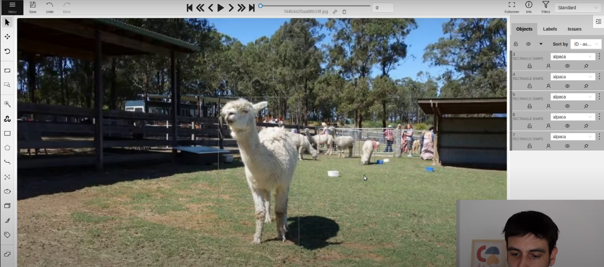

# YOLO
# YOLO Object Detection
---
1.  Data Preparation
   Gather and prepare the datasets that the model will train on. This involves collecting images and their corresponding labels.

Collect a dataset of images relevant to the detection tasks.
Annotate images with bounding boxes around each object of interest. Annotations typically include the class of the object and the coordinates of the bounding box.
Split the data into training, validation, and test sets.

2. Model Training
   Train the YOLOv8 model on the prepared dataset to detect specified objects.
   Initialize the YOLOv8 model with pre-trained weights if available, which can help in achieving better accuracy and faster convergence.
Train the model using the training dataset while validating its performance on the validation set to monitor overfitting.
Adjust hyperparameters as necessary based on performance metrics like loss and accuracy.
3. Model Evaluation
   Assess the trained model’s performance to ensure it meets the desired accuracy and efficiency.
   Evaluate the model using the test dataset to check how well the model performs on unseen data.
Use metrics such as precision, recall, mAP (mean Average Precision), and IoU (Intersection over Union) to measure performance.
4.  Model Optimization and Tuning
    Enhance the model’s performance and efficiency, especially for deployment in resource-constrained environments.
    Apply techniques like quantization, pruning, and knowledge distillation to reduce model size and inference time without significantly affecting accuracy.
Tune the model further if needed based on deployment needs.
5. Deployment
   Deploy the model to a production environment where it can make real-time predictions.
   Convert the trained YOLOv8 model to a format suitable for the deployment platform, such as ONNX, TensorFlow, or a specific format for edge devices.
Integrate the model into an application or system where it can receive input data, perform inference, and output the detection results.
Monitor the model's performance and update it periodically as needed based on feedback and performance data.
6. Monitoring and Updates
   Ensure the model remains effective and accurate over time as new data and scenarios emerge.
   Continuously monitor the model’s performance in the field.
Retrain the model with new data or refine it to adapt to changes in the object types or environmental conditions.

Project Video Link
[Click Here](https://youtu.be/m9fH9OWn8YM?si=xgZVflwTOgYEMJiE) Youtube video link.

## Data Annotaion
Use cvat platform [Click Here](https://www.cvat.ai/) sign up, use try for free verion and creat an account.
Open and click on project. Give name of the project and add label/ add all the labels if there are multiple classes.
Then creat task and it will add all the classes and upload all the images you are going to annotate. You can aslo select subset to divide image into train, test and validate. After uploading images click on submit and open. One its done click on job number and start annoting. Now from left hand side click on rectangle and click on class from Draw new retangle, the drage and draw bounding boxes. On the right side you will see number of annotated image; press save as frequently as possible.

Next step is to format the data to that the YOLO V8 accepts. For this go to Tasks, click on actions and click on export task from dropdown and from multiple format click on YOLO format and click OK. Once task annotation is completed it will get downloaded automatically, there will be 4 files, opening directory you will find multiple images, find multiple files with same name as original image in txt format. If we open txt file it there will be 5 numbers where first number tells class and other number tells coorinate of bounding box. 
2 0.778803 0.620750 0.345085 0.312071. Some txt files has 2 or more such numbers indiating the image is annotated with multiple images.
